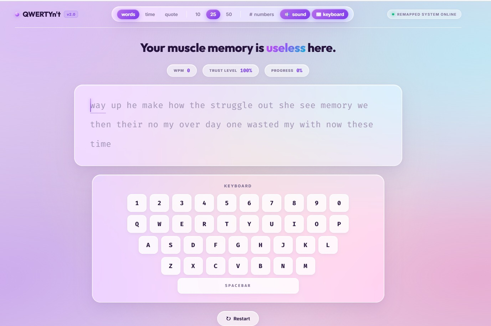
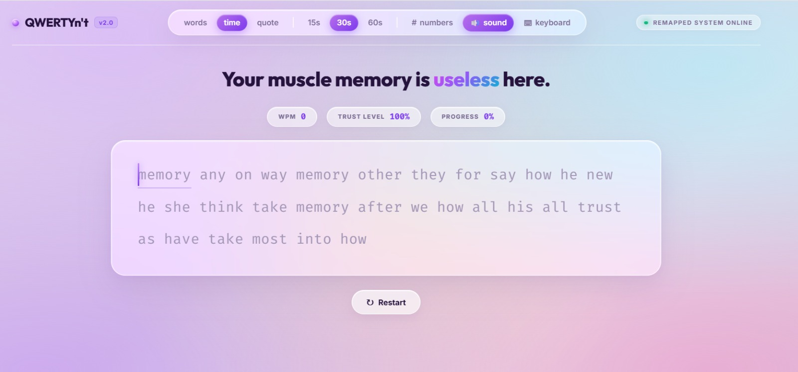
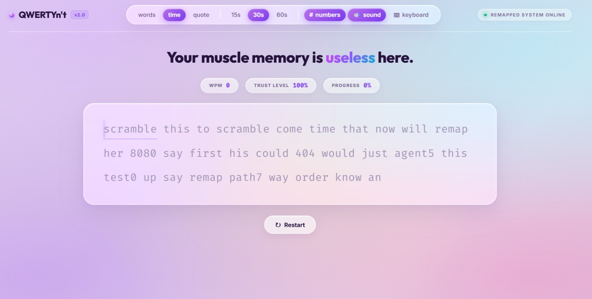
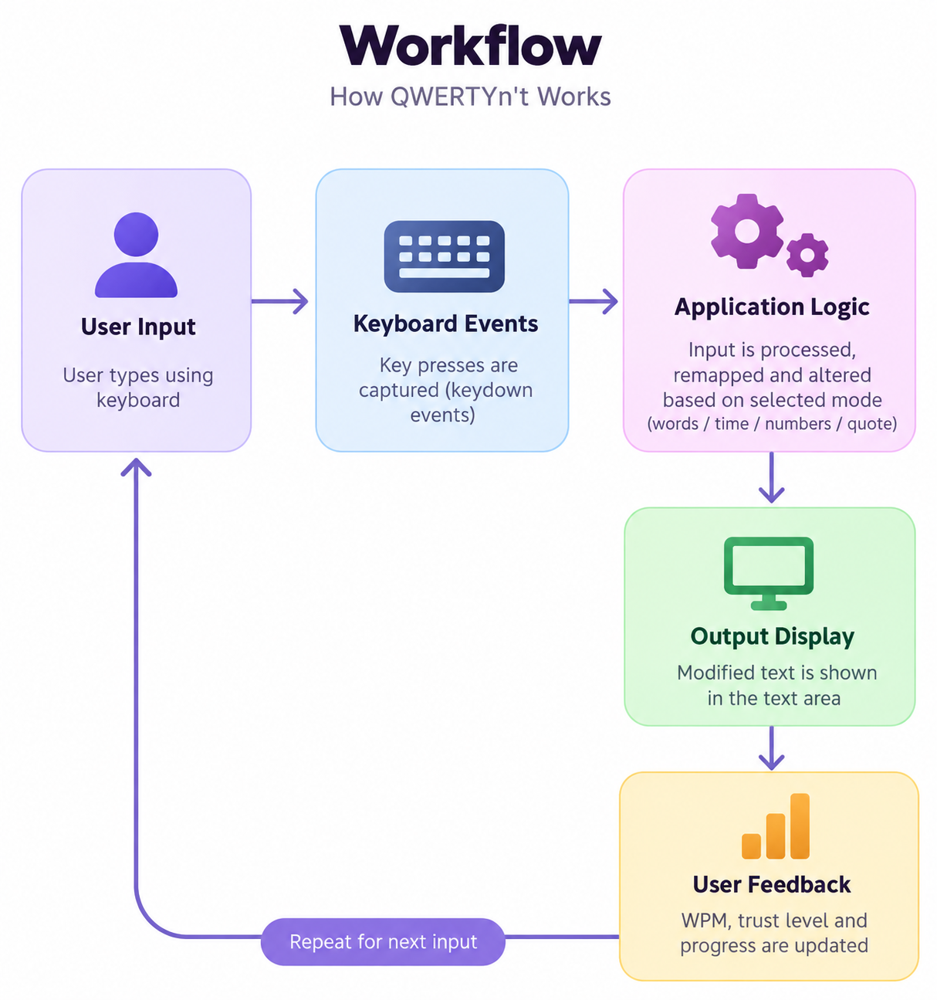

# QWERTYn't — The Keyboard That Disagrees 🎯

## Basic Details

### Team Name: QWERTYn't

### Team Members

* Team Lead: Angelina Binoy - St. Joseph College Of Engineering And Technology, Palai
* Member 2: Aksa Vinod -  St. Joseph College Of Engineering And Technology, Palai
* 
### Project Description

QWERTYn't is a fun, intentionally useless web project that turns a normal typing experience into a frustrating and unpredictable one. Instead of simply accepting what the user types, the keyboard reacts in unexpected and humorous ways.

The project is designed purely for entertainment, trolling, and demonstrating how ordinary user interactions can be turned into a deliberately chaotic experience.

### The Problem (that doesn't exist)

Typing is already far too convenient.

Users can press a key and confidently expect the correct character to appear. There is absolutely no reason for this level of reliability.

QWERTYn't solves this completely unnecessary problem by making the keyboard disagree with the user and introducing chaos into an otherwise perfectly functional typing experience.

### The Solution (that nobody asked for)

QWERTYn't provides a deliberately unpredictable typing interface where the user's input can be altered, rejected, or responded to in humorous ways.

The project takes a familiar keyboard interface and turns it into an unnecessarily complicated experience designed to make users question whether they are typing correctly—or whether the keyboard simply has its own opinions.

## Technical Details

### Technologies/Components Used

For Software:

* HTML
* CSS
* JavaScript
* React.js
* Node.js
* Vite
* Git & GitHub
* Web browser

For Hardware:

* No special hardware required
* Computer/Laptop with keyboard

### Implementation

For Software:

The application implements an interactive keyboard and typing interface using React. User interactions are captured through keyboard and UI events, and the application dynamically processes the input to produce the intentionally unexpected behavior.

The interface is designed with a playful visual style and responsive interactions to make the typing experience feel more like an interactive prank than a conventional keyboard.

## Installation

Clone the repository:

```bash
https://github.com/axa-vinod/useless_project_temp.git
```

Install the required dependencies:

```bash
npm install
```

## Run

Start the development server:

```bash
npm run dev
```

The application will normally be available at:

```text
https://axa-vinod.github.io/useless_project_temp/
```

Open the displayed local URL in a web browser to interact with QWERTYn't.

### Project Documentation

For Software:

## Screenshots



*Main typing interface with the remapped keyboard.*



*Time-based typing mode with a countdown option.*



*Typing mode with numbers enabled and remapped input.*

## Diagrams



*Workflow showing the interaction between user input, keyboard events, application logic, and the displayed output.*


## Additional Demos

* Live/Local Demo: `https://axa-vinod.github.io/useless_project_temp/`
* GitHub Repository: `https://github.com/axa-vinod/useless_project_temp`

## Team Contributions

* **Angelina Binoy:** Backend Development
* **Aksa Vinod:** Frontend development

---
Made with ❤️ at TinkerHub Useless Projects 


